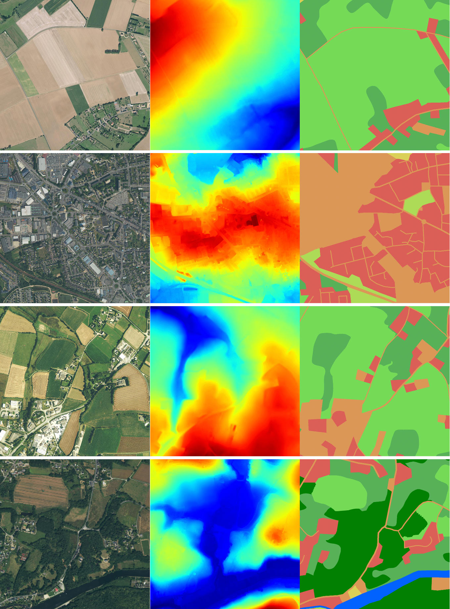
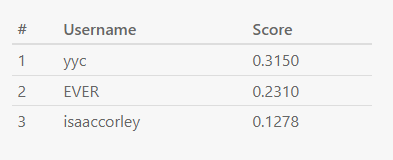

# DFC2022 Baseline

</img>

A simple baseline for the [2022 IEEE GRSS Data Fusion Contest (DFC2022)](https://www.grss-ieee.org/community/technical-committees/2022-ieee-grss-data-fusion-contest/)

This repository uses TorchGeo, PyTorch Lightning, and Segmentation Models PyTorch to train a U-Net to perform semantic segmentation on the DFC2022 dataset. Masks for the holdout set are then predicted and zipped to be submitted. Note that the the baseline is only trained on the small labeled train set containing imagery from the Nice and Nantes Saint-Nazaire regions.

## Install packages

```bash
pip install -r requirements.txt
```

## Dataset

The dataset can be downloaded at the [DFC2022 IEEE DataPort page](https://ieee-dataport.org/competitions/data-fusion-contest-2022-dfc2022) and unzipped into a root folder. In our case this is `data/`.

## Train

```bash
python train.py --config_file conf/dfc2022.yaml
```

## Predict

```bash
python predict.py --log_dir checkpoints/version_0/ --predict_on val --output_directory outputs --device cuda
cd outputs && zip -r submission.zip ./
```

## Submit

Upload `submission.zip` to the evaluation server [here](https://codalab.lisn.upsaclay.fr/competitions/880#participate-submit_results). This baseline results in a mIoU of `0.1278` on the heldout validation set and as of 1/12/22 is 3rd place on the leaderboard.

</img>

## Checkpoints

Checkpoints can be downloaded from the following [link](https://drive.google.com/drive/folders/1WCb4snI9RKO_Q3PoAck1JHh3x0Q_b_oB?usp=sharing)
